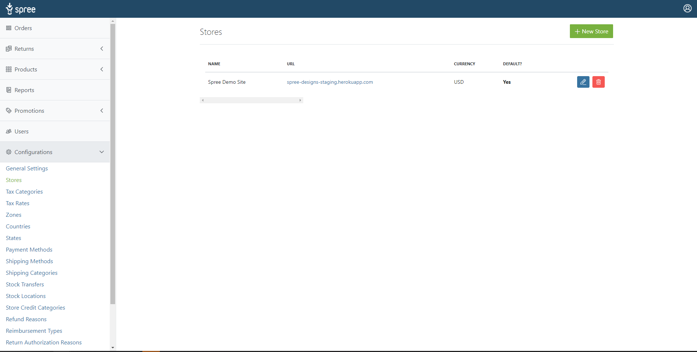
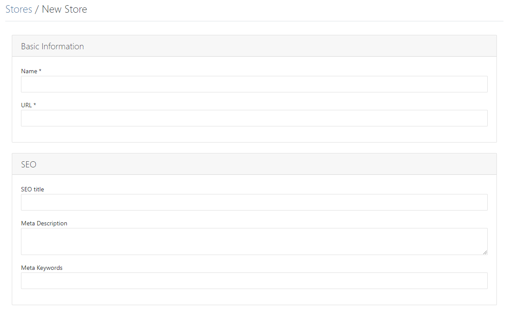
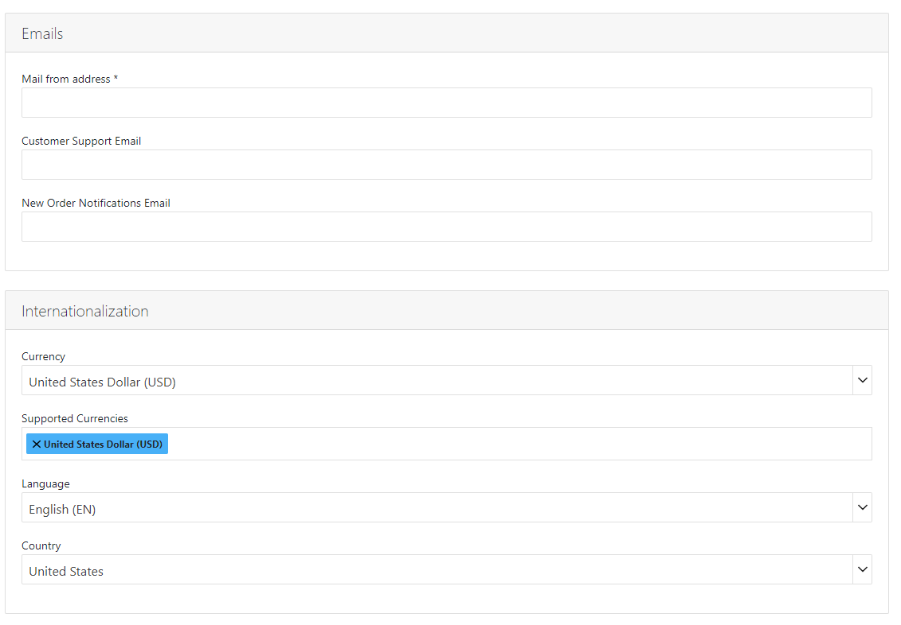
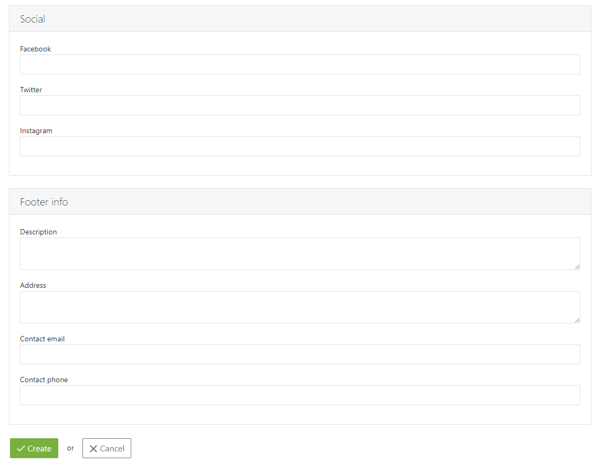

## Introduction

Spree 3.5 was released with Multi Store support. This means that, in a single Spree Admin panel, you can control multiple shops based on Spree. You can assign domains and manage orders; there is also an option to personalize products for a certain shop described [here](#product-and-shop-currency).

### Setup

Setup is simple. You just need at least two sites based on Spree with registered domains.

Open the Spree Admin panel and, under the Configurations tab, search for Stores.

To make it even easier, one site is already set up to your current default. All you need to do is press the [Edit](#edit-store) button in order to personalize it to your needs.

### Create New Store

In the right upper corner, press the *New Store* button (as shown in the screenshot above).

* **Name** - value for you to recognize it
* **URL** - a line separated list of fully qualified domain names used to associate a customers session with a particular store (you can use localhost and/or IP addresses too)
* **Meta Description** - to make it easier for a customer using Google search to click your link
* **Meta Keywords** - words to describe your page as clearly and attractively as possible
* **SEO title** - the title shown in the browser tab when a user visits your page; for example, on a Chrome tab
* **Mail from address** - mail which will send notifications such as order confirmation/shipping to the users
* **CODE** - which is an abbreviated version of the store's name (used as the layout directory name, and also helpful for separating partials by store).

Once you have completed these fields, press **Create**, and your multi store is setup and ready to go. It's that simple!

### Edit Store

In order to Edit an existing Store, simply press **Edit** button next to the Default and Delete.

Inside, you will find the same values as described above in [Create New Store](#create-new-store).

Once you have finished editing, press the **Update** button.

### Customization

Each store can have its own layout(s). These should be located in your site's theme extension in the app/views/spree/layouts/store#code/ directory. So, if you have a store with a code of "alpha", you should store its default layout in app/views/spree/layouts/alpha/spree_application.html.erb.

It is worth mentioning that [Analytics](/user/configuration/configuring_analytics.html) can be associated with a store.

### Orders

If the user places an order on any of your sites, you can observe which store processed the Order.
Simply enter the Orders tab (you can learn more about it [here](/user/orders/))and choose any order that you would like to check. Look for the "Store" option on the panel on the right side.

### Future development

In versions of Spree later than approximately 4.0 or 4.1, two additional extensions should be included to the Spree Core in order to improve Multi Store management and possibilities.

[Spree Multi Domain](https://github.com/spree-contrib/spree-multi-domain)

[Spree Multi Currency](https://github.com/spree-contrib/spree_multi_currency)
