## Introduction.

There is a possibility to edit existing users. When you enter the **Users** tab, simply search for the specific user that you would like to edit and press the **Edit** icon.

## General Settings

When you first open the account editing page you will see **General Settings**.

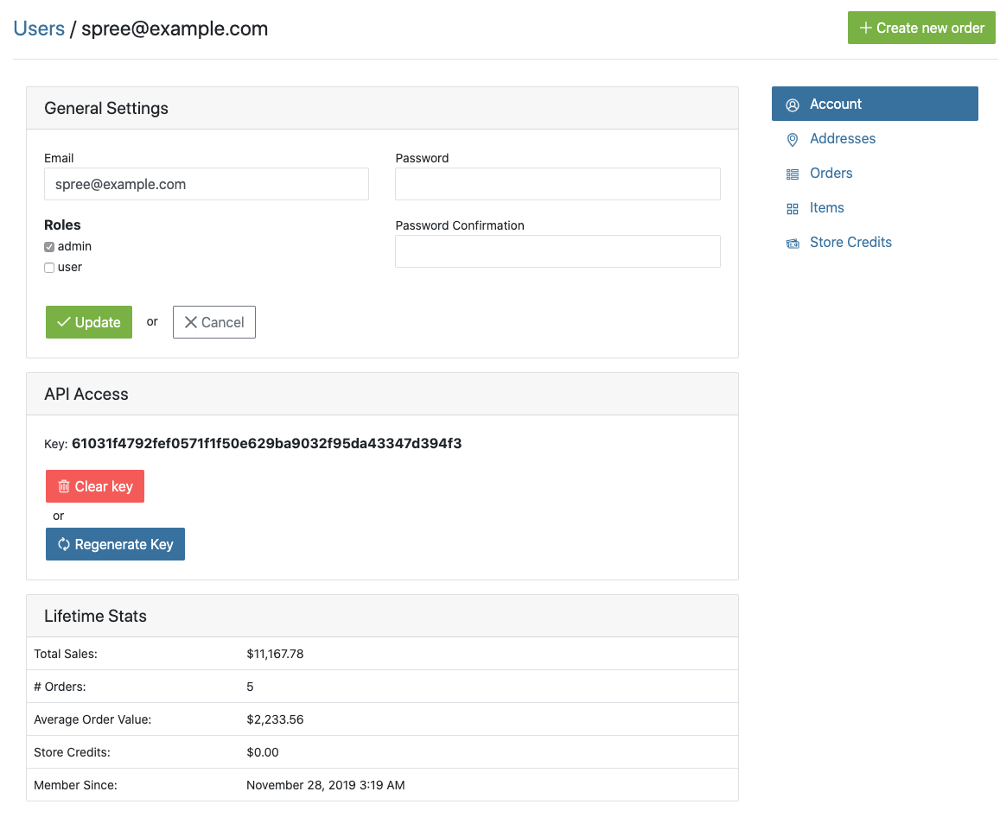

In this page you can make additional changes to the user like email, roles and password. You can also see, **Clear** and **Regenerate Key** API Keys.

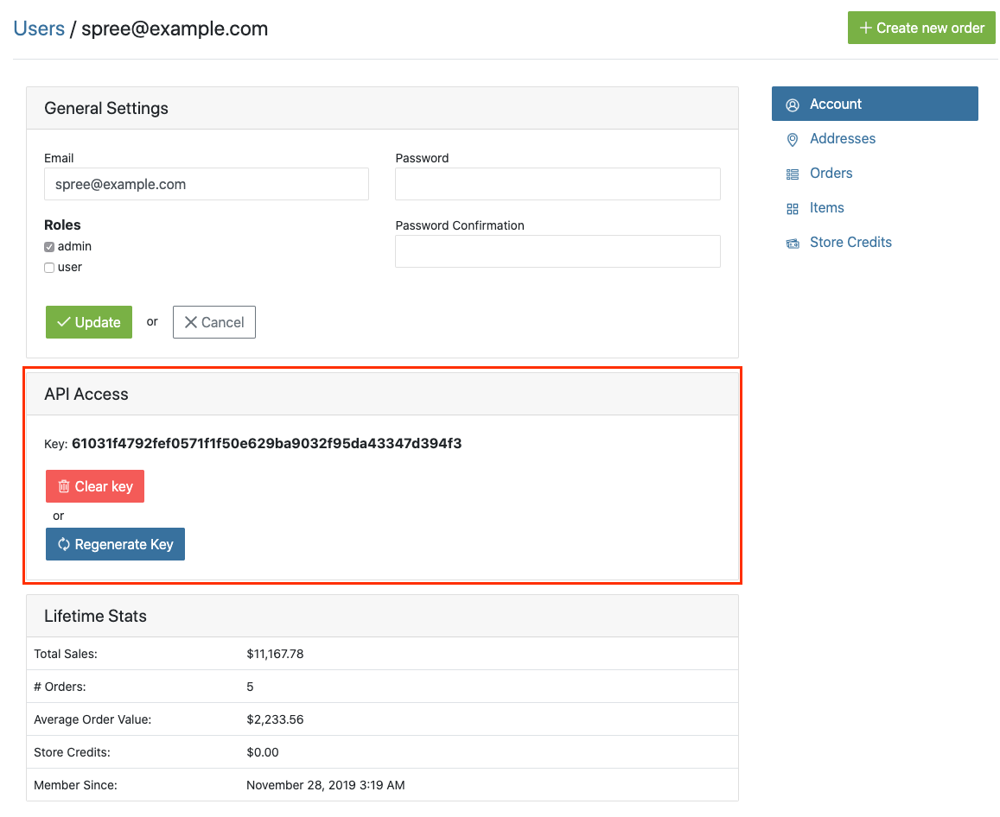

Moreover there are **Lifetime Stats** collected by Spree. You can see the following:

* **Total Sales** - Defines how much money the user has spent in your store.
* **Orders** - Shows how many orders the user has placed.
* **Average Order Value** - Shows the average amount spent by the user in each transaction with your store.
* **Store Credits** - You can get more information about Store Credits below.
* **Member Since** - Shows the date when the user created an account on your site.

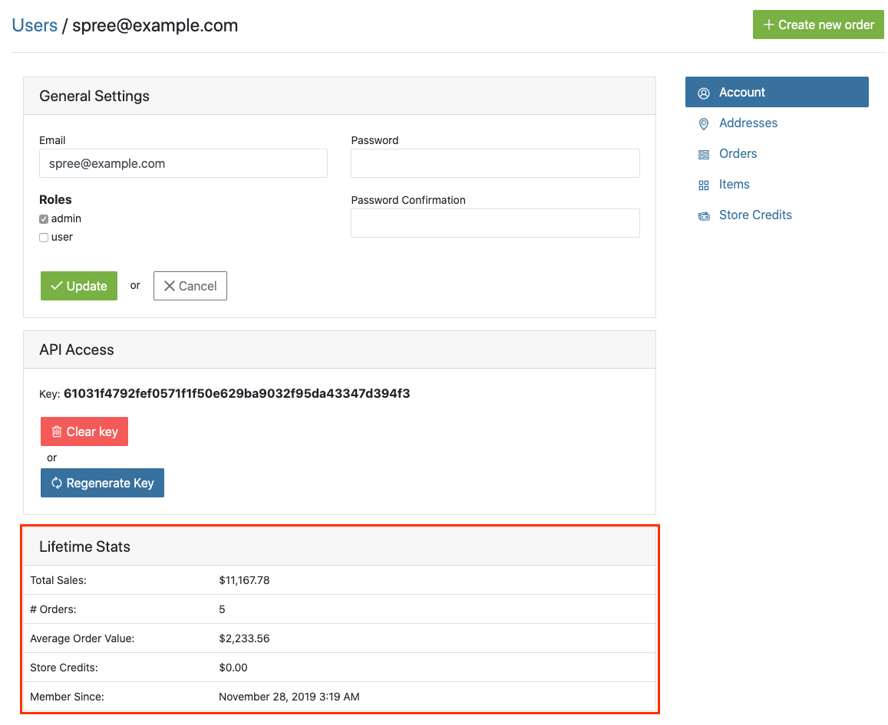

### Addresses

In this section, you can manage addresses (**Shipping** and **Billing**) defined by the user during the checkout. There are also **Lifetime Stats** visible at the bottom of this page.
When you make changes to addresses, you have to press the **Update** button in order to save the changes. If you don't want to save them, simply press the **Cancel** button.

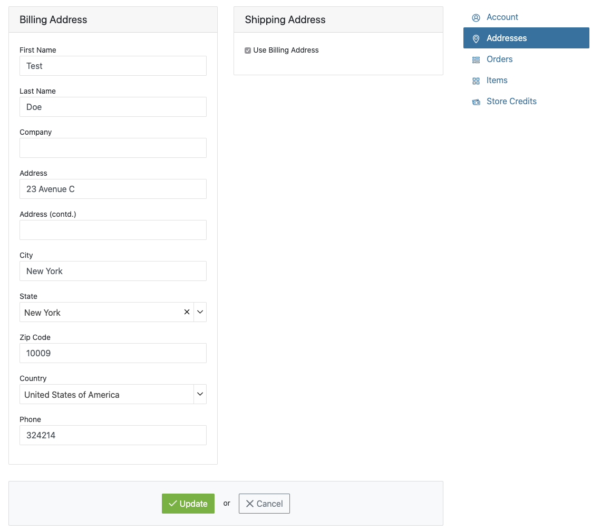

### Orders

This is a simple review of all orders created by the user. There are also **Lifetime Stats** visible at the bottom of this page. A few options are worth mentioning:

* **Completed at** - The date on which the user created a particular order.
* **Number** - The unique ID for a particular order; you can also move directly to the order when you click the ID.
* **State** - The current state of a particular order; you can find more [about order state here](/user/orders/order_states.html).
* **Total** - The total price of a particular order.

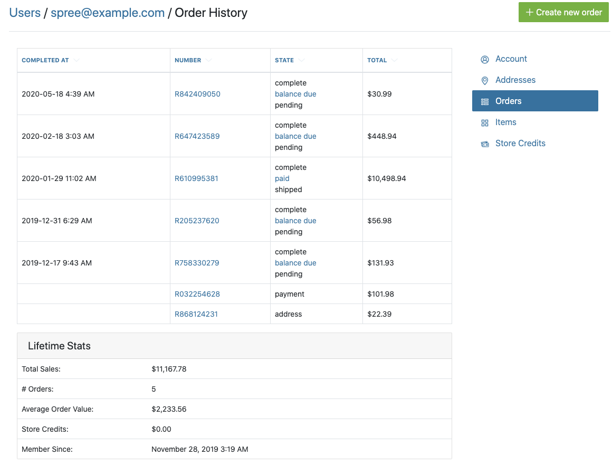

### Items

Very similar to the **Orders** tab; however, a few more options are present here regarding the items purchased by the user:

* **Completed at** - The date on which the user created an order for the specific item.
* **Description** - The information about a certain item; full name of the product, its SKU number and image.
* **Price** - Price without taxes and shipping cost.
* **Quantity** - Total number of purchased products.
* **Total** - Total price of a certain order.
* **State** - As previously mentioned, there is more information [here](/user/orders/order_states.html).
* **Order #** - An order's unique ID that hyperlinks you to the order's details.

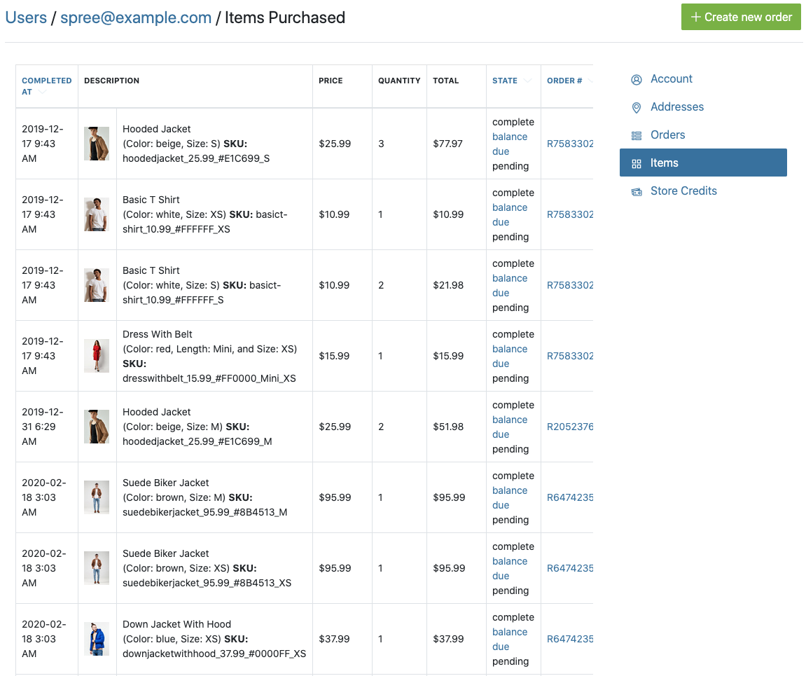

### Store Credits

Firstly, to add store credit to the User, you have to create a **Category** which you can learn more about [here](/user/configuration/configuring_store_credit_categories.html).
Once you create a category you can assign Store Credit to the Users by simply clicking **Edit** on a certain User and pressing **Store Credit** in the right panel.

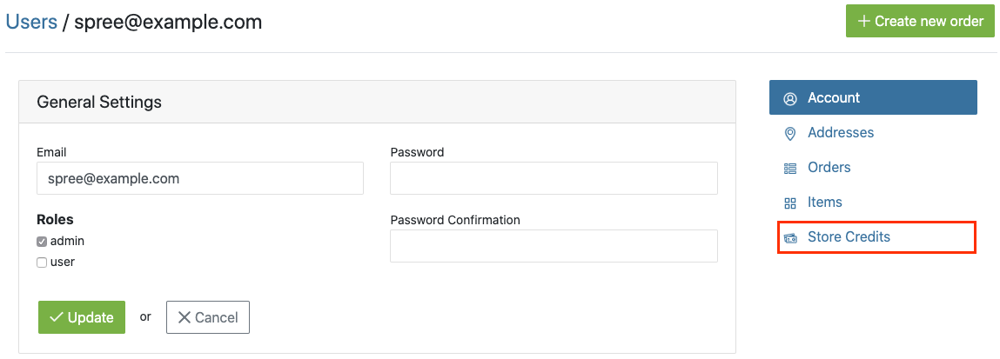

You will see the **Store Credit** panel. As with every other tab in the User's account you can see **Lifetime Stats**.

To add Store Credits press **Add Store Credit**.

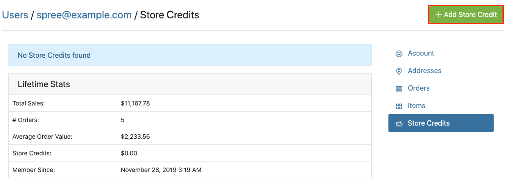

At this point, you can choose the value that the User will receive, set the category and put any important information within the **Memo** field. The memo field is visible to all other admins that will edit Store Credits added by you. Press the **Create** button to accept your changes or press **Cancel** to exit without saving the changes.

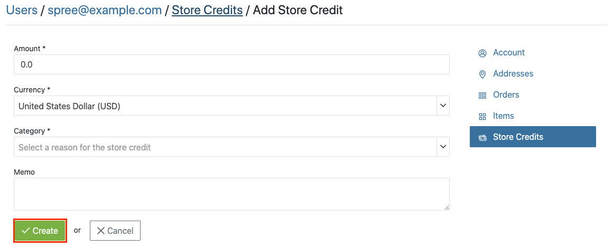

You can now see how the Store Credit is assigned to the user. New options are visible here:

* **Credited** - Value that shows how many Store Credits have been added to the User account.
* **Used** - Amount of Store Credits spent.
* **Category** - Category that Store Credits were assigned to.
* **Created By** - The Admin's email that added Store Credits to that particular User.
* **Issued On** - Date of granting Store Credits.

As an Admin, you can edit or delete Store Credits previously assigned to the User.

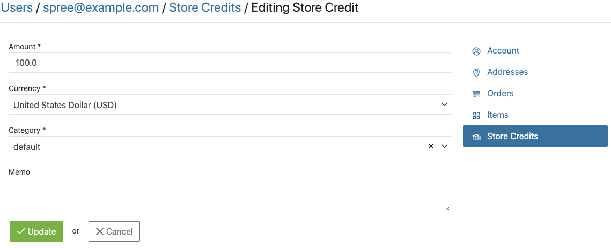

Editing Store Credits will present you with the same options as adding them.

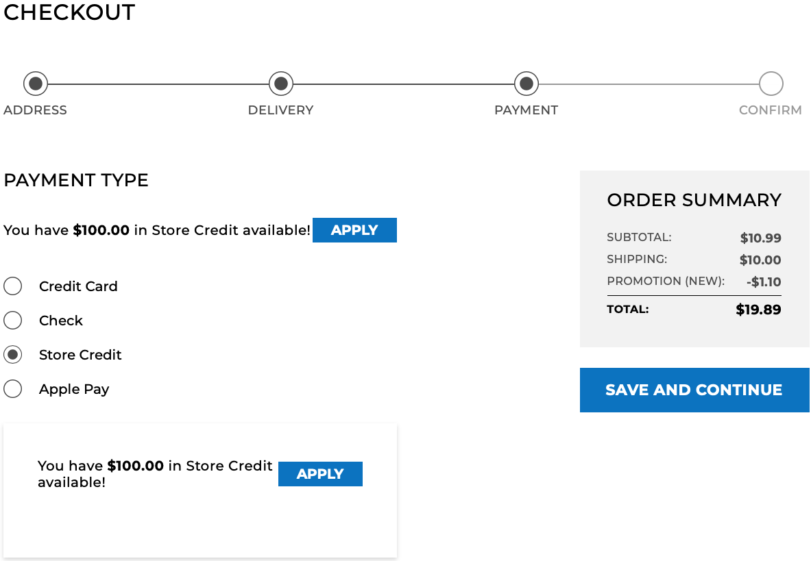

Store Credits are visible to the User in a few places during checkout. It's worth mentioning that the User is not forced to use Store Credits during the Payment process - the Spree default. Spree gives users the choice to pay full price with Credit Card or use Store Credits.

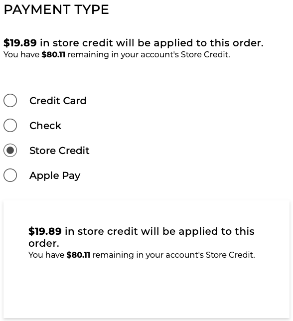

Once the User decides to use the Store Credits there is the possibility to cancel this choice.

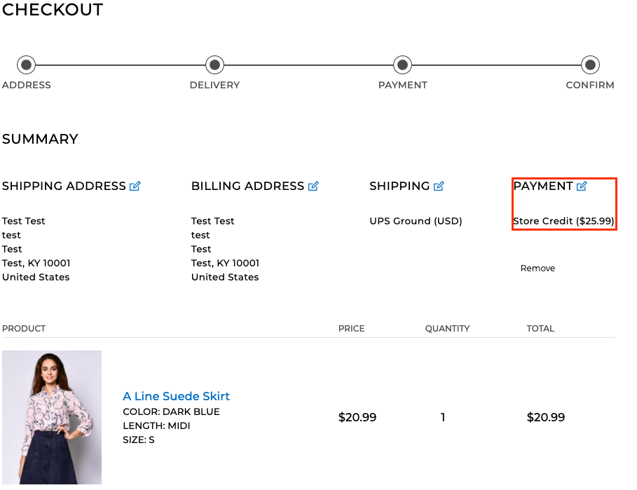

If the user uses Store Credits and the amount does not cover whole value of the order, the rest will be charged to Credit Card or PayPal.

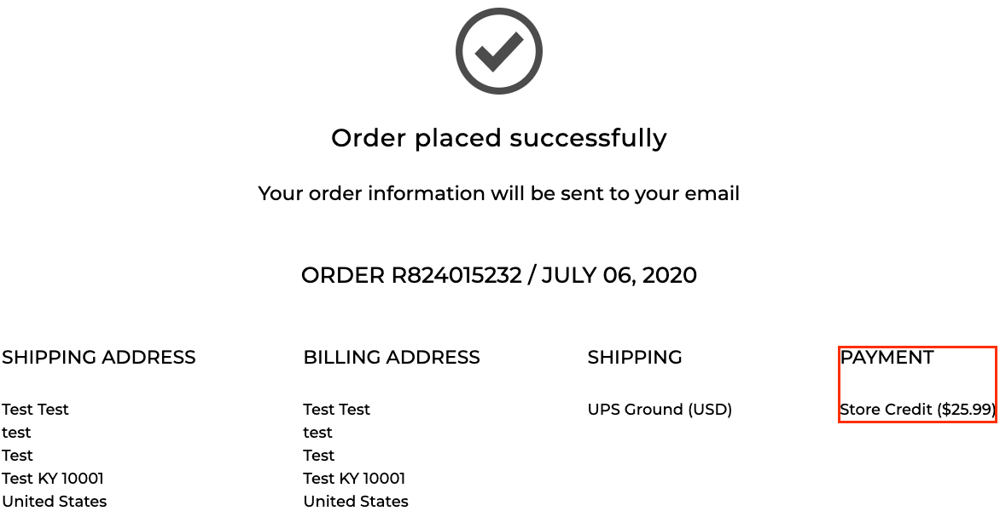

Once the order has been placed there is recapitulation of the order. The user can see the following: **Billing Address**, **Shipping Address**, **Shipment method**, as previously chosen by the user; **Payment Information** including how much store credit, if any, has been assigned to the order; and **Items purchased** along with information about order's payment.

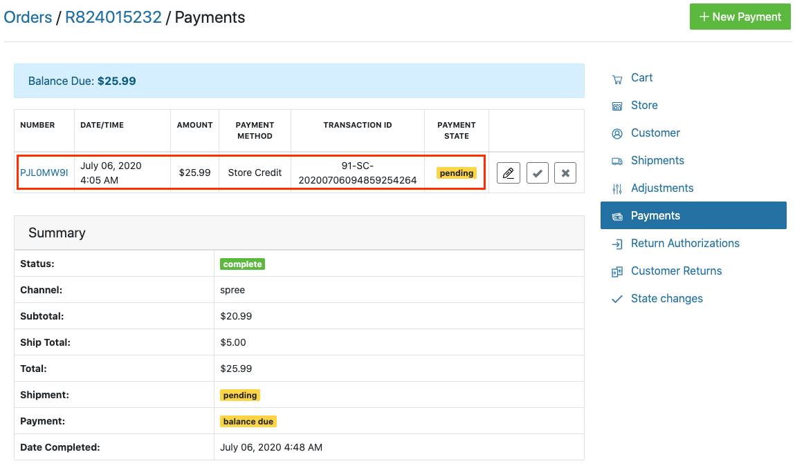

As an Admin you are able to check how the user paid for the order. Simply choose the order that you would like to inspect and go to the **Payments** tab. If you don't know where to find this tab you can find out [here](/user/orders/entering_orders.html). Admins have to capture payments manually by default. In order to enable Automatic Payment Capture for the future payments we strongly recommend reading about it [here](/user/payments/payment_methods.html).

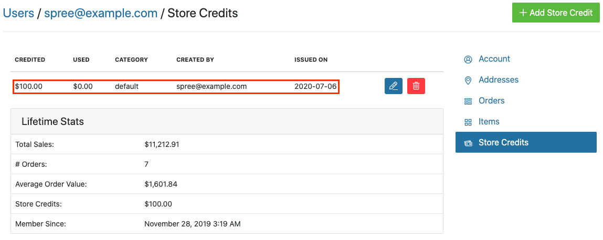

Also as an Admin you can observe used Store Credits in **Users -> Store Credits**.

